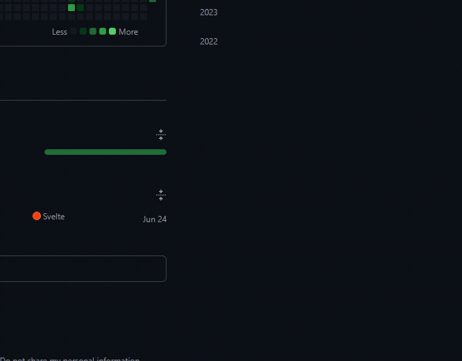

**HA Companion** is a lightweight desktop application for managing a Home Assistant smart home system directly from the Windows taskbar.

The application resides in the system tray and opens the control panel via a mouse click or a keyboard shortcut.

  
demo

  

    
  

## Features

* **Convenient Access**: The panel appears above the tray icon upon a left-click. It automatically hides when it loses focus (clicking anywhere else on the screen).
* **Keyboard Control**: Show or hide the panel from any application using the global keyboard shortcut `Ctrl + Alt + H`.
* **State Synchronization**: Toggle buttons for devices update their status in real-time.
* **Windows Integration**: The panel features native Acrylic blur effect and smooth animations.
* **Quick Access to Full Web UI**: A dedicated button allows opening the full Home Assistant web interface in a separate window.
* **Settings**: The built-in configuration screen allows changing the server URL, access token, interface accent color, and transparency level.

## Configuration Guide

1. Download and run the application installer (`.exe`) for Windows.
2. The settings screen will open automatically on the first launch.
3. Fill in the required fields:
   * **URL**: The address of your Home Assistant server (e.g., `http://192.168.1.100:8123`).
   * **Token**: Long-Lived Access Token. To generate it, open Home Assistant, go to your profile (bottom left corner) -> "Security" tab -> scroll down to the bottom and click "Create Token".
4. Click "Save".

## Known Bugs

* **Sensor Updates**: Some sensor values fail to update automatically in real-time.
